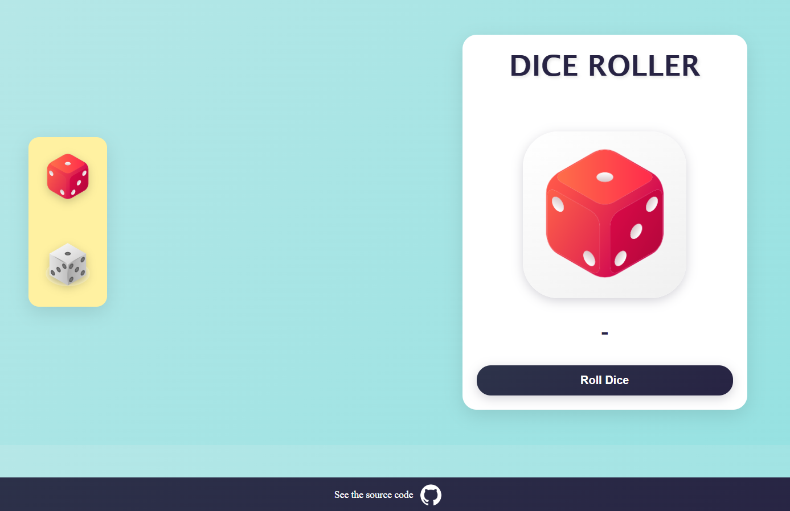

# Dice Roller
A simple web-based dice roller application designed for board gamers, and anyone in need of virtual dice rolls.

## 🎲 Features
* **Multiple Dice Choice:** Choose the dice you like.

* **Randomized Rolls:** Each roll generates a random result, simulating real dice rolls.

* **User-Friendly Interface:** Clean and responsive design for an optimal user experience across devices.

## 🌐 Access the App

* Visit the live application here: [Play Dice Roller here]( https://dice-roller-eight-henna.vercel.app)

## 🔧 Built With
* **Frontend:** HTML, CSS, JavaScript

* **Hosting:** Vercel

## 👥 Contributors

## Contact 
*For any questions or feedback, please contact:*

#### Ravikant Tarare

📩 [ravikanttarare2001@gmail.com](mailto:ravikanttarare2001@gmail.com)

📞 [+91-8275957698](tel:+918275957698)